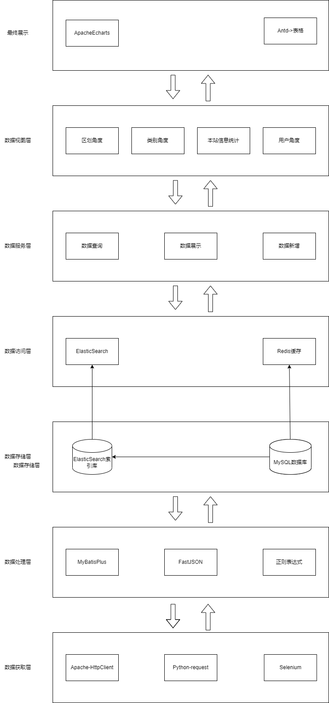
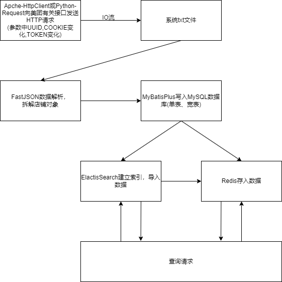

    <h1>
        4.西安各商圈餐饮分析系统架构说明书
    </h1>

[TOC]

## 1. 引言

### 1.1 编写目的

本文档的编写目的在于说明本软件的系统架构，具体包括软件系统的基本实现，各个子模块的功能与子模块之间的联系。

### 1.2 读者对象

本软件开发的协作人员与本软件的使用人员,以及后期想对系统进行扩展和维护的人员。

### 1.3  软件项目概述

软件名称：西安各商圈餐饮分析系统

软件用途：一个toC的西安各商圈餐饮流量分析系统。为消费者提供数据参考。

开发人员：实习实践第四组

### 1.4 定义、首字母缩写与缩略语

无

## 2. 范围与约束

### 2.1 软件功能

参考《西安各商圈餐饮分析系统需求规约》

### 2.2 开发约束

软件为前后端分离的B/S架构。

前端使用React实现，后端使用SpringBoot+MyBatisPlus+Redis+ElasticSearch实现。

### 2.3 项目范围

项目本身仅关注西安、西安商圈中的餐饮行业，做销量、流量、价格、类型方向的分析。

## 3. 总体设计

### 3.1 架构设计目标与项目环境

#### 3.1.1 架构设计目标

架构设计的目标是为了解决目前或者未来软件系统由于复杂度可能带来的问题。就目前而言，架构设计主要是为了识别、梳理用例模型交互、功能模块实现、接口设计和概念模型设计等涉及到的复杂点，再针对这些复杂点制定处理方案，从而通过设计来增强效用、减少成本，降低复杂度。而就未来而言，系统架构设计将随着业务发展不断演变、完善，以解决未来软件系统由于复杂度可能带来的问题。

#### 3.1.2 开发环境

| 项目     | 详细信息                                                     |
| -------- | ------------------------------------------------------------ |
| 操作系统 | windows11                                                    |
| 开发工具 | VSCode, IntellijIDEA, Pycharm                                |
| 编程语言 | TypeScript，HTML, CSS，Java, Python                          |
| 使用技术 | 前端：React+AntDesign; 后端：SpringBoot+MyBatisPlus+Redis+ElasticSearch |
| 其他环境 | 数据库：MySQL8.0.31；云上其他技术支持：阿里云                |

#### 3.1.3 运行环境

| 项目         | 详细信息                                                     |
| ------------ | ------------------------------------------------------------ |
| Browser      | 建议：Chrome内核浏览器（FireFox可能会出现CSS样式不一致问题 不推荐） |
| 总体运行环境 | CentOS7.6,Nginx/1.20.1                                       |
| 前端部署环境 | nodejs18.0.1环境, pm2托管                                    |
| 后端部署环境 | JDK1.8, ElasticSearch7.12.1, MySQL8.0.31, Redis6.2.8, pm2托管 |
| 硬件环境     | 阿里云轻量应用服务器(2核CPU，4GB内存，80G硬盘)               |

### 3.2 系统架构设计

### 3.3 系统数据流

### 3.4 系统模块划分与数据库设计

#### 3.4.1 系统模块划分

+ 数据采集模块
    数据采集模块主要是通过网页爬虫定时对目标网站的新闻文章数据进行爬取，爬取的间隔参数可以通过系统管理页面配置。
+ 处理分析与数据存储模块
    实时处理分析与数据存储模块接收数据采集模块采集到的数据，处理抓取得到的请求结果JSON，再根据需求数据进行处理、分析，最终存入MySQL，Redis与ElasticSearch。
+ 数据查询搜索模块
    数据查询搜索模块负责搜索查询MySQL，Redis与ElasticSearch存储的数据，提供接口让前端进行查询并展示。
+ 前端展示模块
    接收后端的查询到的数据，对数据进行可视化展示。
+ 登录模块
    登录模块负责允许用户登录后进行搜索。

#### 3.4.2 数据库设计

采用窄列宽表模式设计MySQL数据库

数据表名称：

xian_meituan_catering

| 列名          | 约束                     | 数据类型   | comment                      | default          |
| ------------- | ------------------------ | ---------- | ---------------------------- | ---------------- |
| id            | not null, auto increment | bigint     | 门店id(也许可以用美团默认的) |                  |
| title         | not null                 | varchar50  | 门店名称                     |                  |
| frontImg      | not null                 | varchar200 | 门店logo                     | /img/default.png |
| avgScore      | not null                 | float      | 门店平均评分                 | 0.0              |
| allCommentNum | not null                 | int        | 门店总评价数                 | 0                |
| address       |                          | varchar20  | 商圈名称                     |                  |
| avgPrice      | not null                 | int        | 人均消费                     | 0                |
| type          |                          | varchar20  | 门店类别                     |                  |
| longitude     |                          | double     | 经度                         |                  |
| latitude      |                          | double     | 纬度                         |                  |

数据表名称：

user

| 列名     | 约束                     | 数据类型   | comment   | default |
| -------- | ------------------------ | ---------- | --------- | ------- |
| id       | not null, auto increment | bigint     | 用户id    |         |
| username | not null                 | varchar50  | 用户名    |         |
| password | not null                 | varchar200 | 密码 加密 |         |

### 3.5 接口设计

参考《接口说明书》

## 4. 特性设计

### 4.1 性能

#### 4.1.1 内存占用

内存占用约4G左右。

#### 4.1.2 响应速度

在网络正常的情况下用户点击网页后页面的跳转时间<=1s，页面数据的加载时间<=5s；若页面的数据量较大而导致的页面加载时间长的话，页面必须提供网页加载提示。

### 4.2 可维护性与可扩展性

系统基于大数据生态组件构建，鉴于大数据组件的横向扩展能力，系统的可扩展性有一定保证。系统代码的开发需要满足代码开发规范，需要做好充分的注释、注意代码的可复用性、注意功能模块之间解耦能力，使得系统能够以较低成本进行二次开发、进行功能扩展、进行系统维护。

### 4.3 可交互性

系统的人机交互符合人的认知心理学基本原理，并且需要降低系统工作人员的学习成本，必要的话还要提供系统使用的帮助文档。

### 4.4 可靠性

在系统发生故障后，需要保证系统可以在较短时间内重建其性能水平并恢复直接受影响数据的能力，并且使系统故障率保持在一定的水平下。

### 4.5 安全性

系统需要保证数据的安全，防止数据的泄漏等。
