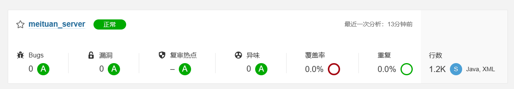
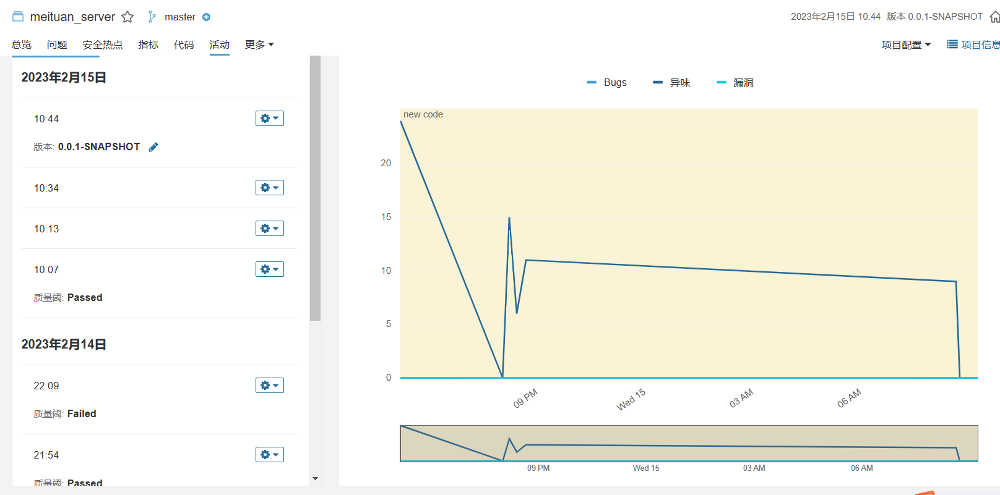
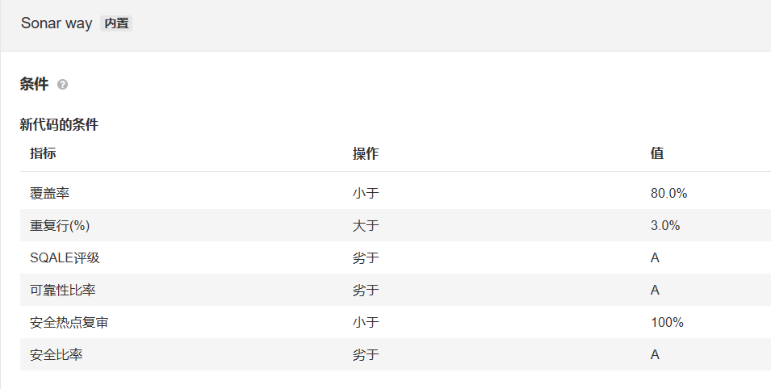

<div align="center">
    <h1>
        7.测试分析报告
    </h1>
</div>

[TOC]

## 1. 引言

### 1.1 背景

软件全称为西安各商圈餐饮流量分析系统。本软件是一个基于前后端分离架构开发的网页，为web用户提供便捷的访问体验。允许用户通过本系统查看数据中台，对相关信息进行检索。作为一个数据中台产品，本产品希望补全当前市面上不存在的toC的餐饮行业流量分析空缺。当前以美团与大众点评为主的o2o本地生活网站都忽略了toC的数据展示。近些年才兴起的年终总结等总结报告的内容提供形式的爆火，在一定程度上说明了C端客户对于数据的总结与分析是存在浓厚兴趣的。本软件将尝试消除西安餐饮方面的这种空白，为C端访问者提供一点基于大量数据整合后产生的参考。

### 1.2 使用工具

+ 静态测试： SonarQube 9.2 (Docker环境)
+ 接口测试： ApiFox，IntellijIDEA HTTP Client


## 2. 静态测试

使用SonarQube结合GitHub Actions进行静态测试。每次主分支提交代码时自动触发Actions进行代码扫描。

```yaml
name: Sonarqube Check
on:
  push:
    branches:
      - main # or the name of your main branch

jobs:
  build:
    name: Build
    runs-on: ubuntu-latest
    steps:
      - uses: actions/checkout@v2
        with:
          fetch-depth: 0  # Shallow clones should be disabled for a better relevancy of analysis
      - name: Set up JDK 17
        uses: actions/setup-java@v1
        with:
          java-version: 17

      - name: Cache SonarQube packages
        uses: actions/cache@v1
        with:
          path: ~/.sonar/cache
          key: ${{ runner.os }}-sonar
          restore-keys: ${{ runner.os }}-sonar

      - name: Cache Maven packages
        uses: actions/cache@v1
        with:
          path: ~/.m2
          key: ${{ runner.os }}-m2-${{ hashFiles('**/meituan_server/pom.xml') }}
          restore-keys: ${{ runner.os }}-m2

      - name: Build and analyze
        env:
          GITHUB_TOKEN: ${{ secrets.GITHUB_TOKEN }}  # Needed to get PR information, if any
          SONAR_TOKEN: ${{ secrets.SONAR_SERVER_TOKEN }}
          SONAR_HOST_URL: ${{ secrets.SONARQUBE_HOST }}
        run: cd ./meituan_server && mvn -B verify org.sonarsource.scanner.maven:sonar-maven-plugin:sonar -Dmaven.test.skip=true -Dsonar.projectKey=meituan_server
```

代码将被提交到https://sonar.wangminan.me接收静态检查

项目总体情况如下



缺陷控制情况如下



采用的质量阀如下



所有静态测试之问题已得到修正。

## 3. 接口测试

本次接口测试将使用ApiFox对后端4个controller提供的11个接口进行测试

### 3.1CategoryController

#### 3.1.1 不同类别商户的数量接口

通过ApiFox向/type/number发送GET请求

请求结果如下


返回值正常，接口无异常

#### 3.1.2 不同类别商户的均价接口

通过ApiFox向/type/avgPrice发送GET请求

请求结果如下


返回值正常，接口无异常

#### 3.1.3 不同类别商户的评价数量接口

通过ApiFox向/type/flow发送GET请求

请求结果如下


返回值正常，接口无异常

### 3.2DistrictController

#### 3.2.1 不同区划餐饮商户数量接口

通过ApiFox向/district/merchantNumber发送GET请求

请求结果如下


返回值正常，接口无异常

#### 3.2.2 不同区划餐饮商户的评价数量接口

通过ApiFox向/district/flow发送GET请求

请求结果如下


返回值正常，接口无异常

#### 3.2.3 不同区划中不同类别餐饮商户数量接口

通过ApiFox向/district/merchantType发送GET请求

请求结果如下


返回值正常，接口无异常

#### 3.2.4 不同区划的餐饮商户评价数量接口

通过ApiFox向/district/avgPrice发送GET请求

请求结果如下


返回值正常，接口无异常

#### 3.2.5 不同区划商圈名称接口

通过ApiFox向/district/list发送GET请求

请求结果如下


返回值正常，接口无异常

### 3.3SearchController

#### 3.3.1 输入建议接口

通过ApiFox向/suggestion发送POST请求

请求结果如下


返回值正常，接口无异常

#### 3.3.2 选项搜索接口

通过ApiFox向/query发送POST请求

请求结果如下


返回值正常，接口无异常

### 3.4SmartAdviceController

#### 3.4.1 智能推荐接口

通过ApiFox向/smartSuggestion发送POST请求

请求结果如下


返回值正常，接口无异常

## 4. 集成测试

在前端和后端开发均完成后将项目进行集成，对整个项目进行整体功能性测试，主要从能否满足项目需求的角度进行测试

### 4.1数据可视化功能

包括对西安市内不同区划，不同类别店家的数量，人均消费，评价数量的纵、横对比可视化

可视化结果如下


从页面显示结果来看，数据可视化无异常，数据可视化功能正常

### 4.2搜索功能

#### 4.2.1 输入建议

在搜索栏输入内容时，能根据输入内容在搜索栏下方显示推荐输入


输入建议内容正常显示，功能无异常

#### 4.2.2 组合搜索

能通过搜索栏上方的选项自定义搜索的区划、商圈和店家种类进行组合搜索，并将搜索结果显示在搜索栏下方


能通过选项进行搜索自定义，同时搜索结果正常显示在搜索栏下方，该功能无明显异常

#### 4.2.3 智能搜索

点击“转到智能搜索”可以切换到智能搜索页面，并自动获取用户的地理位置，用户在输入关键字后根据关键字和用户位置智能推荐符合要求且距离较近的商家


智能搜索返回结果正常，功能无异常

