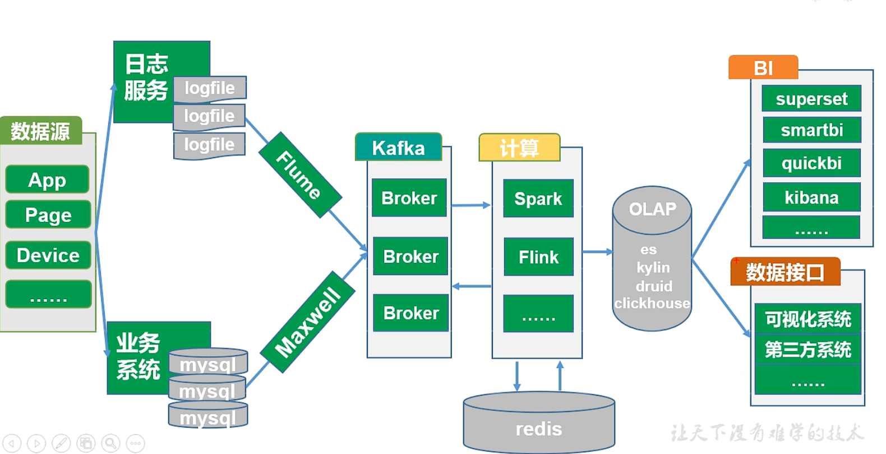
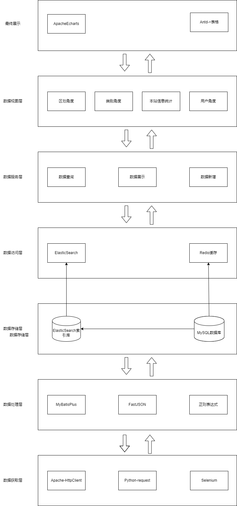
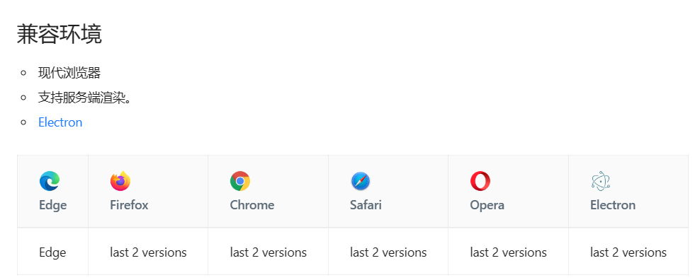

    <h1>
        西安各商圈餐饮分析系统总结报告
    </h1>

[TOC]

## 3. 开发工作评价 

### 3.1 对于实现架构的评价

参考https://www.bilibili.com/video/BV1wZ4y1a7Y6

传统的离线数仓

传统的实时数仓

我们实现的架构：

总体而言项目完成了数仓的功能，但并不属于典型数仓的范畴。

### 3.2 对软件编写的评价

在软件开发前，我们编写了接口文档来统一前后端开发进程；在软件开发的过程中使用了Sonarqube进行代码静态检查，并使用了Postman进行接口检查。总体而言，我们的软件编写是符合规范的。

### 3.3 对软件的总体评价

+ 功能性：这个软件是否满足了用户的需求？它的功能是否实用、易于操作、稳定性如何？

  + 该软件满足了预期的要求，能够展示西安各商圈的餐饮情况。搜索界面清晰明了，易于操作。部署情况稳定，访问情况正常。

+ 用户体验：软件的界面是否美观、简洁？操作是否直观、友好？用户使用起来是否顺畅、舒适？

  + 用户体验一般。用户界面设计缺乏美感。总体响应时间处于可控范围内，不需要较长的等待时间。

+ 可靠性：软件是否稳定可靠，遇到异常情况时是否容错处理得当，有没有频繁崩溃或出错的情况？

  + 软件运行可靠，全局异常处理正常运行。目前CI/CD正常。目前没有出错与崩溃的情况。

+ 兼容性：软件是否能够兼容不同的操作系统或设备，或者在不同的网络环境下表现如何？

  + 前端：本软件为web软件，根据antd的文档来看，软件兼容情况如下

    

  + 后端：软件使用springboot编写，打包后为一个jar包，需要jdk17运行环境。可移植性强。

+ 安全性：软件是否能够保护用户的数据安全，有没有安全漏洞或者易受攻击的风险

  + 软件中不存在敏感信息。安全性不属于本次软件编写的考量范畴。

+ 更新与支持：软件是否能够持续得到更新和维护，是否能够及时修复漏洞和问题，有没有良好的技术支持和用户反馈渠道？

  + 配置了CICD，自动更新方便及时。

## 4. 经验与教训

在开发一个软件之前应当做充分学习。不应当接手自己完全没有知识储备的项目。